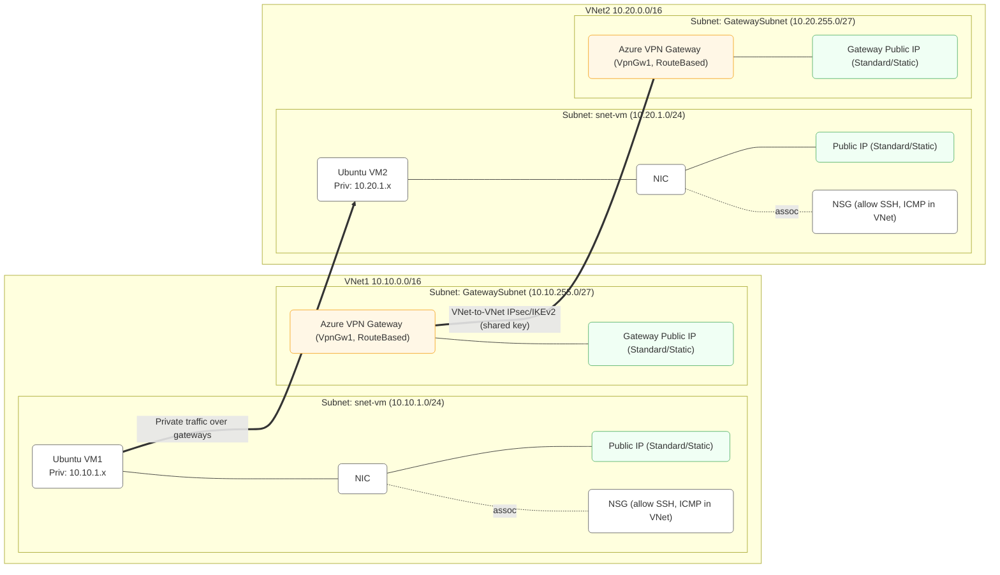

Diagram

```mermaid
flowchart LR
  %% ======= Styles =======
  classDef vnet fill:#eaf4ff,stroke:#4a90e2,stroke-width:1px,rx:8px,ry:8px
  classDef subnet fill:#ffffff,stroke:#9fbbe7,rx:6px,ry:6px
  classDef res fill:#fff,stroke:#666,rx:6px,ry:6px
  classDef gw fill:#fff7e6,stroke:#f5a623,rx:6px,ry:6px
  classDef pip fill:#f0fff4,stroke:#57b26a,rx:6px,ry:6px
  classDef nsg fill:#f9f9f9,stroke:#999,stroke-dasharray:3 3,rx:6px,ry:6px

  %% ======= VNet 1 =======
  subgraph V1["VNet1 10.10.0.0/16"]
  class V1 vnet

    subgraph V1S1["Subnet: snet-vm (10.10.1.0/24)"]
    class V1S1 subnet
      VM1["Ubuntu VM1<br/>Priv: 10.10.1.x"]
      PIP1["Public IP (Standard/Static)"]
      NIC1["NIC"]
      NSG1["NSG (allow SSH, ICMP in VNet)"]
      VM1 --- NIC1 -. assoc .- NSG1
      NIC1 --- PIP1
    end

    subgraph V1S2["Subnet: GatewaySubnet (10.10.255.0/27)"]
    class V1S2 subnet
      GW1["Azure VPN Gateway (VpnGw1, RouteBased)"]
      GWPIP1["Gateway Public IP (Standard/Static)"]
      GW1 --- GWPIP1
    end
  end

  %% ======= VNet 2 =======
  subgraph V2["VNet2 10.20.0.0/16"]
  class V2 vnet

    subgraph V2S1["Subnet: snet-vm (10.20.1.0/24)"]
    class V2S1 subnet
      VM2["Ubuntu VM2<br/>Priv: 10.20.1.x"]
      PIP2["Public IP (Standard/Static)"]
      NIC2["NIC"]
      NSG2["NSG (allow SSH, ICMP in VNet)"]
      VM2 --- NIC2 -. assoc .- NSG2
      NIC2 --- PIP2
    end

    subgraph V2S2["Subnet: GatewaySubnet (10.20.255.0/27)"]
    class V2S2 subnet
      GW2["Azure VPN Gateway (VpnGw1, RouteBased)"]
      GWPIP2["Gateway Public IP (Standard/Static)"]
      GW2 --- GWPIP2
    end
  end

  %% ======= VPN Connection =======
  GW1 ===|"VNet-to-VNet IPsec/IKEv2 (shared key)"| GW2

  %% IMPORTANT: keep a real blank line between links

  %% ======= Traffic Path =======
  VM1 ==>|"Private traffic over gateways"| VM2

  %% Classes
  class VM1,VM2,NIC1,NIC2,NSG1,NSG2,PIP1,PIP2,GWPIP1,GWPIP2 res
  class GW1,GW2 gw
  class PIP1,PIP2,GWPIP1,GWPIP2 pip

  %% Notes
  %% - No UDR required: routes to remote VNet are injected by VPN Gateways.
  %% - NSG rules allow SSH from Internet (to PIP) and ICMP within VirtualNetwork.
  %% - Public IPs for VPN Gateways must be Standard + Static (azurerm v4).

```