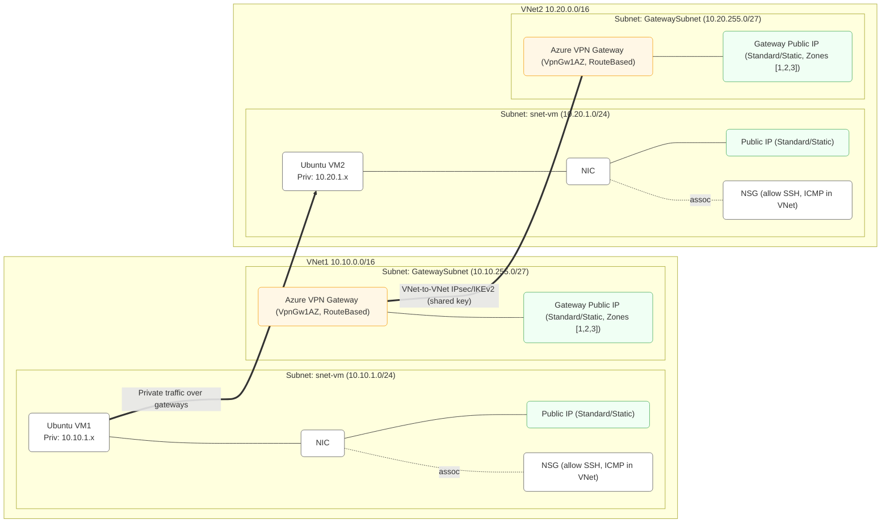

# 🧩 Azure VPN Gateway — VNet-to-VNet Connection Demo

This project demonstrates how to build a **secure IPsec (IKEv2) tunnel** between two isolated Azure VNets using **Azure VPN Gateway (Route-Based)**, allowing virtual machines (VM1 ↔ VM2) in different VNets to communicate over private IPs.

It’s fully automated with **Terraform (azurerm v4)** and designed for testing connectivity across sites in different address spaces without using VNet peering.

## 🗺️ Architecture Overview

Each site hosts its own:

* Virtual Network (VNet)
* Ubuntu VM for testing
* Azure VPN Gateway (RouteBased, `VpnGw1AZ`)
* Standard Public IP for both VM and Gateway
* Network Security Group (NSG) allowing SSH + ICMP

VPN Gateways are linked in a **VNet-to-VNet** connection, using a pre-shared key for authentication.

### Diagram



## ⚙️ Setup Instructions

### 1️⃣ Prerequisites

* Azure CLI authenticated (`az login`)
* Terraform ≥ 1.6.0
* Provider `azurerm` ≥ 4.52.0
* Subscription with permissions to create networking resources

### 2️⃣ Deploy Infrastructure

```bash
terraform init
terraform plan -out tfplan
terraform apply tfplan
```

Note: Azure VPN Gateway use about 25 minutes to provision.

Deployment creates:

* Two Resource Groups: `rg-vnet1`, `rg-vnet2`
* Two VNets (`vnet1`, `vnet2`)
* One Ubuntu VM per VNet
* Two VPN Gateways with VNet-to-VNet connection

> 💡  Takes ~30–45 minutes to provision because VPN Gateways are slow to build.

### 3️⃣ Retrieve SSH Key and IPs

Terraform outputs include all necessary connection details:

```bash
terraform output -raw ssh_private_key_pem > credentials/id_rsa
chmod 600 credentials/id_rsa

terraform output vm1_public_ip
terraform output vm2_public_ip
```

## 🔍 Testing the VPN Connection

### 1️⃣ Verify Tunnel Status

**Via Azure Portal**

* Go to `rg-vnet1 → vngw1 → Connections → gw1-to-gw2`
* Status should show: **Connected**

Or via CLI:

```bash
az network vpn-connection show \
  --name gw1-to-gw2 \
  --resource-group rg-vnet1 \
  --query "{status: connectionStatus, egress: egressBytesTransferred, ingress: ingressBytesTransferred}"
```

### 2️⃣ SSH into VMs

```bash
ssh -i credentials/id_rsa azureuser@<vm1_public_ip>
ssh -i credentials/id_rsa azureuser@<vm2_public_ip>
```

### 3️⃣ Test Private Connectivity

From **VM1**:

```bash
ping 10.20.1.4
traceroute 10.20.1.4
```

From **VM2**:

```bash
ping 10.10.1.4
traceroute 10.10.1.4
```

Expected result → packets go through the VPN Gateway; latency < 10–20 ms in same region.

### 4️⃣ Check Routes

On either VM:

```bash
ip route
```

You should see Azure-injected routes:

```
10.20.0.0/16 via 10.10.255.x dev eth0
```

## 🧠 Notes

* No custom route tables (UDR) are needed — Azure injects routes automatically when using Gateway connections.
* NSGs allow inbound SSH (port 22) and ICMP (ping) within VirtualNetwork.
* Gateways use **Standard + Zone-redundant PIPs** as required by AZ SKUs.
* GatewaySubnet must be named exactly `GatewaySubnet` (case sensitive).

## 🧹 Cleanup

To destroy all resources:

```bash
terraform destroy
```

## 📘 References

* [Azure VPN Gateway Documentation](https://learn.microsoft.com/azure/vpn-gateway/)
* [VPN Gateway SKUs & Availability Zones](https://learn.microsoft.com/azure/vpn-gateway/about-gateway-skus)
* [Terraform azurerm_virtual_network_gateway](https://registry.terraform.io/providers/hashicorp/azurerm/latest/docs/resources/virtual_network_gateway)
